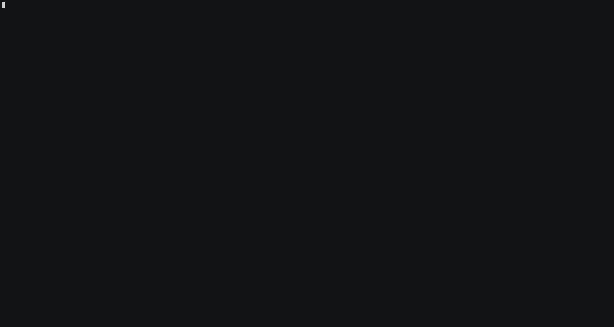

# getsum : Tool for validating and calculating checksums

***getsum*** calculates and validates checksum of files remotely or locally. According to user choice, local downloads can be prevented if their checksum mismatch. You can also run application in listen mode, so you can remotely deploy on your server or cloud provider. Then you can use another getsum as client on host pc (Please see also below docker image section). I get the idea from https://blog.linuxmint.com/?p=2994 so I thought it would be great fit for people who host binaries as well as users to validate their checksum. In validation mode if remote servers are present, then application first calculates checksum on remote servers and if there is a match it will download the file and run another calculation locally.

 [](https://asciinema.org/a/ovpGNqNS56qlrKevUllOks1qT)
 
**Installation**

 Current binaries are stored on [release page](https://github.com/getsumio/getsum/releases). Please consider application only tested on Fedora 30. 
 
linux example:
 ```
 cd /location/to/store
 tar xzvf getsum-linux-amd64.tar.gz
 cd builds/linux/amd64/
 ./getsum -h
 ``` 
 add binary location to /etc/profile or ~/.bashrc or if you have alternatives installed:
 ```
 alternatives --install /usr/bin/getsum getsum /location/to/store/getsum 0
 ```

**How to run**

Run 'getsum -h' for all parameters
```
getsum https://some.server.address/binary
getsum /tmp/path/to/file
getsum -a MD5,SHA512 https://some.server.address/binary cf1a31c3acf3a1c3f2a13cfa13
getsum -remoteOnly https://some.server.address/binary cf1a31c3acf3a1c3f2a13cfa13
getsum -h
``` 
**Features**

* Run in server mode to listen requests from another getsum client
* Multiple libraries/application support for calculating checksums
* Calculate checksums by using multiple/all supported algorithms at once
* Download file from internet and calculate checksum
* Prevent download if checksum doesnt match
* Local/Remote only calculations
* Proxy support
* TLS support on listen mode

**Selecting library/applications**

For checksum calculations core Golang libraries will be used as default. If you have installed openssl set *-lib openssl*. If you want to use applications from operating system set *-lib os*.

```
getsum -a MD5 -lib openssl https://some.server.address/binary
getsum -a MD5 -lib go https://some.server.address/binary
getsum -a MD5 -lib os https://some.server.address/binary
``` 

[](https://asciinema.org/a/sy0OSLL8IWUOED2DFk1yFLiOB)


 
**Running Multiple Algorithms** 

Default algorithm is ***SHA512***. Use *-a* parameter to specify different algorithms. Algorithms are comma separated. *-all* runs all algorithms at once (if selected library doesnt support some of them only supported ones will run)

```
getsum -a MD5,SHA512,SHA1 https://some.server.address/binary
getsum -all /tmp/path/to/file
``` 

[](https://asciinema.org/a/nejfc4N0vLJhkxpqikEfHIBCe)
[](https://asciinema.org/a/KA4sT6xTNN9iTzKHJhdgnybrB)

**Validation**
 If another checksum provided application will compare generated one with the given one. If there is mismatch file will be removed from host pc. Use ***-keep*** parameter if you want to keep file even there is mismatch. 
 ```
getsum -a MD5 -keep https://some.server.address/binary cf1a31c3acf3a1c3f2a13cfa13
getsum -remoteOnly https://some.server.address/binary cf1a31c3acf3a1c3f2a13cfa13
getsum -localOnly https://some.server.address/binary cf1a31c3acf3a1c3f2a13cfa13
``` 

**Running in serve mode**

Running in serve mode param is *-s* default listen address is *127.0.0.1* and port is *8088*. In serve mode files are not stored that they are removed after calculation. Set *-dir* param to change save folder, default is current location. There is no authentication method provided by this application, you need to handle it if you are planning to run servers in public.
```
getsum -s 
getsum -s -l 0.0.0.0 -p 9099
getsum -s -l 0.0.0.0 -p 9099 -tk /tmp/tlskeyfile -tc /tmp/tlscertfile
``` 
**Updating client to run with remote servers**

Create a config file at **$HOME/.getsum/servers.yml** with addresses of your servers, i.e.:
```
servers:
  - name: gce-west-us
    address: http://127.0.0.1:8088
  - name: aws-eu-north
    address: http://127.0.0.1:8089
  - name: azure-east-us
    address: http://127.0.0.1:8090
```
"**servers,name and address" field names should be same** you just need to update values. 
Also use *-serverconfig* parameter for custom config location:
```
getsum -serverconfig /tmp/servers.yml /path/to/file
getsum -sc /tmp/servers.yml /path/to/file
``` 

[](https://asciinema.org/a/KA4sT6xTNN9iTzKHJhdgnybrB)

**In case of 'os' selected**:
below commands will be called:
* For ***Linux/Mac*** :  *md5sum,sha1sum,sha224sum,sha256sum,sha384sum,sha512sum*
* For ***Windows*** : *certUtil* will be called 

**Supported Algorithms**:
* ***Windows***: MD2, MD4, MD5, SHA1, SHA224, SHA256, SHA384, SHA512
* ***Linux/MAC***: MD5, SHA1, SHA224, SHA256, SHA384, SHA512
* ***GO***: MD4,MD5,SHA1,SHA224,SHA256,SHA384,SHA512,RMD160,SHA3_224,SHA3_256,SHA3_384,SHA3_512,SHA512_224,SHA512_256,BLAKE2s256,BLAKE2b256,BLAKE2b384,BLAKE2b512
* ***OPENSSL***: MD4,MD5,SHA1,SHA224,SHA256,SHA384,SHA512,RMD160,SHA3_224,SHA3_256,SHA3_384,SHA3_512,SHA512_224,SHA512_256,BLAKE2s256,BLAKE2b512,SHAKE128,SHAKE256,SM3

**Browser Addons**
I will also write browser addons next week (4.November+) so you can set your servers on browser extension and validate during download.

**Docker image**
```
docker pull getsum/getsum
docker run -p127.0.0.1:8088:8088 getsum/getsum
```


**Serverless support**
 I really wanted to add native lambda, cloud functions support for different providers but each provider has their own limits i.e. 200mb storage space or 2GB memory, so its currently postponed.
 
 **Issues**
 Application tested only on linux. If you had issues please raise here. Also unit tests are missing I will implement this month. 
 
 **How to support**
  Code review, pull requests, raise issues, promote :) 
